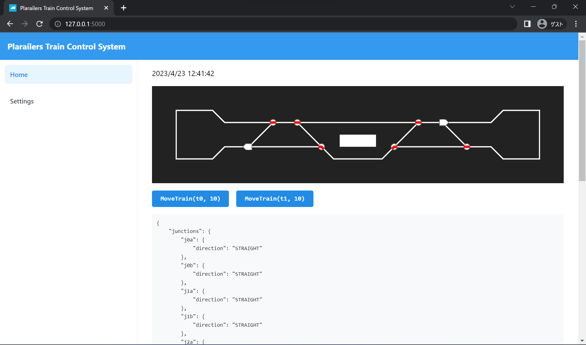

# Plarailers Train Control System (仮)

列車制御システム (作成中)



## フォルダ構造

このディレクトリは Poetry プロジェクトと npm プロジェクトが混ざったものになっています。
サブディレクトリとして、以下の Poetry パッケージと npm パッケージを含んでいます。

- `ptcs_control` (Poetry)
  - 列車の制御アルゴリズム
- `ptcs_server` (Poetry)
  - `ptcs_control` から取得したシステムの状態を `ptcs_ui` に配信したり、指示を送ったりする
- `ptcs_ui` (npm)
  - `ptcs_server` から取得したシステムの状態をブラウザに表示したり、指示を送ったりする
- `ptcs_client` (npm)
  - `ptcs_server` の型定義から自動生成した、クライアント用のライブラリ

## 使用者向け

### 最初にやること

Python と Poetry が必要です。

- [Poetry のインストール方法](https://python-poetry.org/docs/)

### インストール

```bash
poetry install
```

### システム起動 (実機なし)

```bash
poetry run server
```

起動後、http://127.0.0.1:5000 にアクセスしてください。

### システム起動 (実機あり)

PC に基地局を接続した上で、ptcs_server/server.py のポート指定部分を編集し、--bridge オプションをつけてサーバーを起動します。

```bash
poetry run server --bridge
```

起動後、http://127.0.0.1:5000 にアクセスしてください。

将来的には BLE による一対多通信を実装する予定のため、ポート指定なしで動くようになると思います。


## 開発者向け

使用者向けにはあらかじめビルドされた UI が `ptcs_ui/dist` に入っていますが、開発するときには UI 用の開発サーバーを立てることができます。
UI 用の開発サーバーを使うと、ソースコードの変更がリアルタイムで反映されるようになります。

### インストール

```bash
poetry install
npm install
```

### 開発サーバー起動

```bash
# ptcs_server をデバッグモードで起動
poetry run server --debug

# ptcs_ui を起動
npm run ui:dev
```

起動後、http://localhost:5173/ にアクセスしてください。

## VS Code 使用者向け

リンターやフォーマッター関連の設定をうまく反映させるために、`ptcs/` ディレクトリがルートに来る必要があります。
以下のいずれかの方法を取ってください。

- `ptcs/` を単体で開く
- VS Code のマルチルートワークスペース機能を使う。リポジトリ直下の `.vscode/ptcs.code-workspace` を開いて「ワークスペースを開く」を押すと、リポジトリと `ptcs/` が両方ルートに来ます
